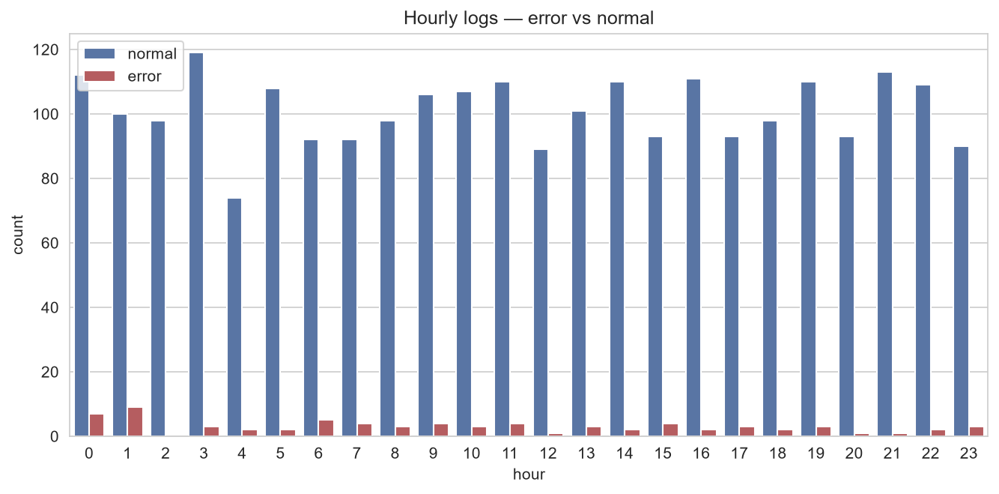

# 모두마켓 웹 접속 로그 — EDA & 시각화 보고서

## 1. 데이터 개요
- 행/열: (2502행, 7열)
- 주요 컬럼: log_id, session_id, response_time_ms, request_path, device, hour, is_error

## 2. 결측 진단 (missingno)
- `response_time_ms` 결측 비율: 4.8%
- 결측 패턴: (어디에 몰려 있나 — hour 기준 / 시간 정렬 후 관찰)
- 의심 가설: (예: 심야 시간대 측정 모듈 점검으로 측정값 누락 등)

## 3. 정제와 검증 (전·후 분포 비교)
- 적용한 정제: 중복 제거 / device 표기 통일 / hour 이상치 / response_time_ms 결측 대체 / 극단치 클리핑
- KDE 비교 결과: (본질이 유지됨 / 한쪽이 좁아짐 등)
- device distinct: 5 → 2 (정상)

## 4. 탐색에서 도출한 새 질문
- (예) "새벽 시간대 에러 응답 비중이 낮보다 높은가?"
- (예) "`/checkout` 응답 시간이 다른 경로보다 길다 — 결제 단계 최적화 후보인가?"
- 로그 수가 시간대별로 지그재그로 움직이는 데에 패턴이 존재하는가? 존재한다면 원인은?
- 응답시간의 이상치가 오류 발생시간과 겹치는가? 오류가 발생해 응답시간이 늘어난 것은 아닌가?
- /home과 /product의 박스플롯이 비슷한 모양과 값을 띄고 있는데 두 경로가 유의미한 차이를 갖고 있는가? 

## 5. 전달용 차트 1개 (이미지 또는 코드 인용)
- 차트 한 장 + "한 줄 메시지"

시간대 별로 로그수를 나열했을 때 에러로그는 새벽에 몰려있다!

## 6. 다음 분석 제안
- (예) 에러 응답 원인 추적 / 시간대 세분화 분석 / 디바이스별 성능 비교

- 새벽 시간대 에러 집중 현상의 원인 조사 (배치 작업, 특정 device/path와의 연관성 확인)
- 응답시간과 에러 발생 간 상관관계 검증 (타임아웃 가설: 응답이 길수록 에러로 이어지는가?)
- /checkout 응답시간 지연의 구조적 원인 분석 (결제 API·DB 트랜잭션 등 병목 구간 추정)

