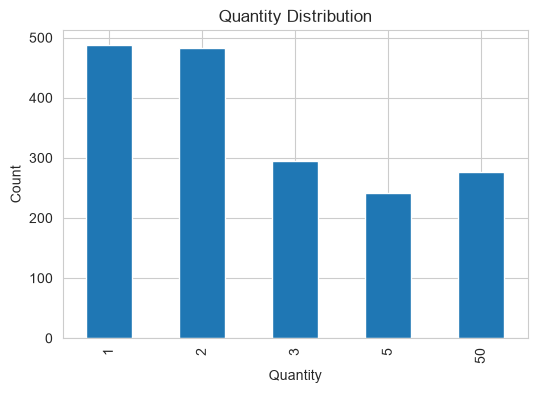
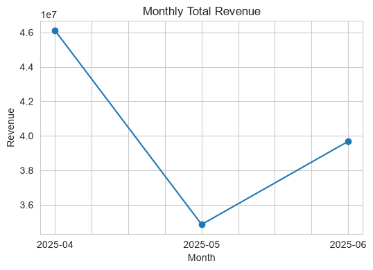

# 빵셀러 데이터 정제·집계 보고서

## 1. 데이터 개요
- 출처: (가상) 빵셀러 베이커리 체인 운영 로그
- 기간: 2025-04-01 ~ 2025-06-30 (3개월)
- 원본 행 수 / 정제 후 행 수: ( 2164 )행 → ( 1784 )행

- 한 행이 의미하는 관측 단위: 특정 매장·날짜·시간대에 판매된 상품 1건

- 주요 컬럼의 의미:
  - store_id: 매장 코드
  - date_str: 판매 날짜
  - item: 판매 상품명
  - quantity: 판매 수량
  - unit_price: 상품 단가
  - revenue: 매출(quantity x unit_price)
- 분석에서 특히 중요하게 볼 컬럼: revenue(매출 KPI 핵심), date_str(월별 트렌드), store_id(매장별 비교)

## 2. 발견한 품질 문제
- 결측: (revenue 컬럼  2.77%)
- 중복: ( 321 건)
- 이상치: ( quantity : 50 )
- 표기 혼재: (date_str 칼럼 날짜 표기방식 차이로 혼재, item 칼럼 케익과 케이크 표기 혼재)

## 3. 처리 결정과 근거 (5줄로)
1. 중복 행 ( 321 )건 → 완전 동일 행은 시스템 오류로 간주, 제거
2. store_id 공백 (10건) →  앞뒤 공백 제거로 매장 코드 표준화
3. item '케익' → '케이크' (8건) →  표기 통일로 그룹 집계 오류 방지
4. revenue 음수 → 별도 보관 ( 1 )건 → 환불로 판단, refunds_bakery로 별도 보관
5. revenue 결측 ( 60 )건 → 계산 근거 없어 제거 (이유: 원인 불명, 추정 대체 시 KPI 왜곡 우려)

## 4. EDA 결과

**단일 변수 분포**

quantity는 1, 2, 3, 5, 50 다섯 가지 값으로 구성되어 있으며, 
이 중 50은 전체 건수의 약 14%지만 매출 기준으로는 전체 매출의 약 80.4%를 차지함.

**시간 흐름 분석**

월별 전체 매출을 비교한 결과, 4월(약 4,600만원)에서 5월(약 3,600만원)로 감소했다가 
6월(약 4,000만원)에 다시 소폭 회복함. 다만 데이터가 3개월치뿐이므로 계절성이라고 단정하기는 어려움.

**핵심 KPI**
- 월별·매장별 매출(store_month), 상품별 평균단가·총매출(item_kpi) 참고.

**발견한 인사이트**
1. quantity=50 값은 건수 기준으로는 14%에 불과하지만, 매출 기준으로는 전체의 80.4%를 차지함
   → 소수의 대량 주문이 전체 매출을 견인하는 구조로 판단됨. 
   단순 이상치로 삭제하면 실제 매출 대부분을 놓치게 되어 삭제하지 않고 유지함.

2. 월별 매출 1위 매장이 4월(S06) → 5월(S01) → 6월(S02)로 매월 바뀜
   → 특정 매장이 꾸준히 1위를 유지하지 못하고, 매장별 매출 순위가 매월 크게 변동함.

3. kpi 결과
 (월·매장 관점) 가장 매출이 큰 매장과 그 월: 2025-04월의 S06매장 
 (상품 관점) 매출 1위 상품: 쿠키

## 5. 한계와 후속 작업
1. 분석 기간이 3개월(90일)로 짧아 계절성·연간 트렌드 파악이 어려움
2. revenue 결측 60건을 원인 분석 없이 제거해, 실제보다 매출 KPI가 낮게 잡혔을 가능성이 있음
3. quantity=50이 매출의 80%를 차지해 삭제하지 않았으나, 실제 대량 주문인지 입력 오류인지는 
   이 데이터만으로 단정할 수 없음
4. 환불(refunds_bakery)을 분리만 하고 원인별 분석은 하지 않아, 어떤 상품·매장에서 환불이 
   잦은지는 확인하지 못함 → 환불 사유 컬럼이 추가되면 확인 가능
5. item 표기 통일을 '케익→케이크' 한 가지만 처리해, 다른 오타·변형 표기가 남아있을 가능성이 있음

| 단계 | 액션 | 근거 | 결과 |
|---|---|---|---|
| 1. 중복 제거 | 완전 중복 행 drop | 동일 키 동일 값은 시스템 입력 오류로 간주 | 321건 제거 |
| 2. 문자열 정제 | store_id를 'strip' & item '케익' -> '케이크'로 통일 | 문자열 공백 제거 및 표기 혼재 통일 | store_id 공백 (10건), item 케익 (8건) 통일 |
| 3. 날짜 파싱 | date_str을 datetime으로 | 월별 집계가 분석 목적이므로 datetime 필요 | NaT(파싱 실패): 0건 |
| 4. 이상치 처리 | 음수 revenue 분리, 수량 상위 1% 컷오프 | 매출 분석이 목적이므로 환불은 별도 보관 | 환불 1건, 수량 상위 컷오프 [50] |
| 5. 결측치 처리 | revenue 결측 행 제거 | 결측은 결제 실패 로그로 추정(MCAR 가정), 매출 왜곡 방지 | 최종 60건 내외 제거 |